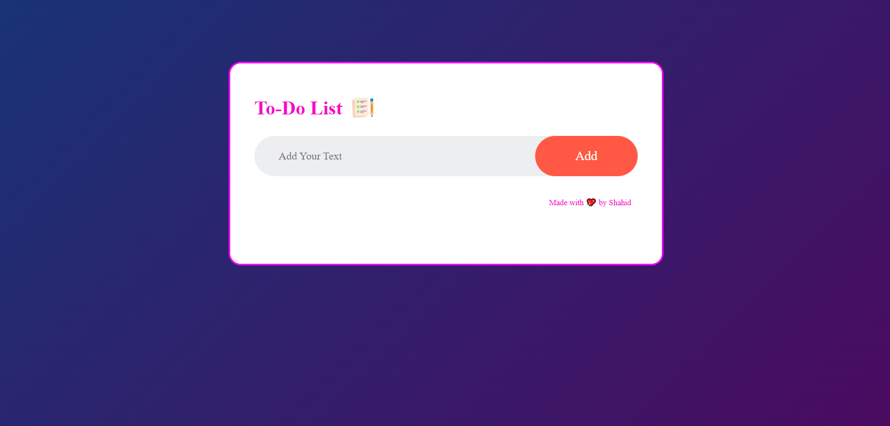

# 📝 To-Do List App

A simple **To-Do List** web app built using **HTML, CSS, and JavaScript**.  
You can add tasks, mark them as completed, and delete them easily.  

---

## 🚀 Features
- ➕ Add new tasks
- ✅ Mark tasks as completed (click to toggle)
- ❌ Delete tasks (× button)
- 📱 Responsive & clean UI

---

## 📂 Project Structure
To-do-List/
│── index.html # Main HTML file
│── style.css # Styling
│── script.js # Functionality
└── Images/ # App icons/images

🛠️ Built With

HTML5
CSS3
JavaScript (Vanilla)

